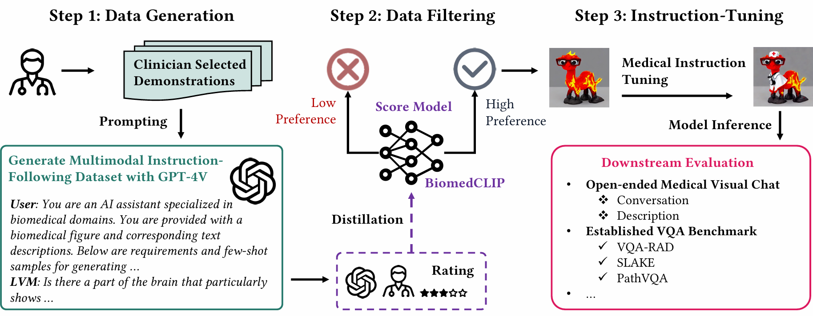

[Paper Link]() | [Dataset Link]()

### Intro

Recent advancements in multimodal foundation models have showcased impressive capabilities in understanding and reasoning with visual and textual information. 
Adapting these foundation models trained for general usage to specialized domains like biomedicine requires large-scale domain-specific instruction datasets.
While existing works have explored curating such datasets automatically, the resultant datasets are not explicitly aligned with domain expertise.
In this work, we propose a data-centric framework, \ours, that incorporates clinician preferences into both stages of generating and selecting instruction data for tuning biomedical multimodal foundation models. First, during the generation stage, we sample a diverse set of instructions to collect clinician preference, which is in turn used to demonstrate GPT-4V to generate large-scale data candidates. Then, during the selection phase, we train a selection model to distill both clinician preferences and GPT-4V self-evaluation for selecting high-quality data candidates for instruction tuning. 
Results show that the model tuned with our generated instructions demonstrates a significant improvement in both open visual chat and benchmark, with a relative improvement of 18.5\% compared to LLaVA-Med.

**In this work**

- We introduce a data-centric framework for creating instruction-following data aligned with clinician preference for biomedical visual instruction tuning. Models tuned on the data achieve a remarkable improvement of 18.5% relatively compared with the state-of-the-art method on open visual chat.
- We propose a novel paradigm for collecting human preference and training a data selection model based on mixed preference resources. We demonstrate that our data selection model excels in matching human preferences for data quality evaluation, outperforming GPT-4. 
- To facilitate further study, we release our comprehensive dataset consisting of 60K clinician preference-aligned instruction-tuning samples, along with the models instruction-tuned based on this dataset.
